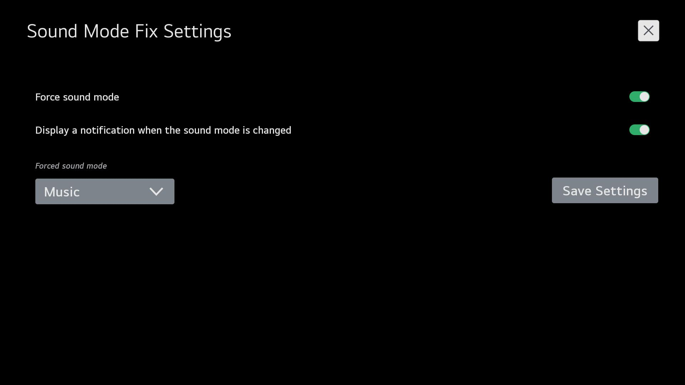
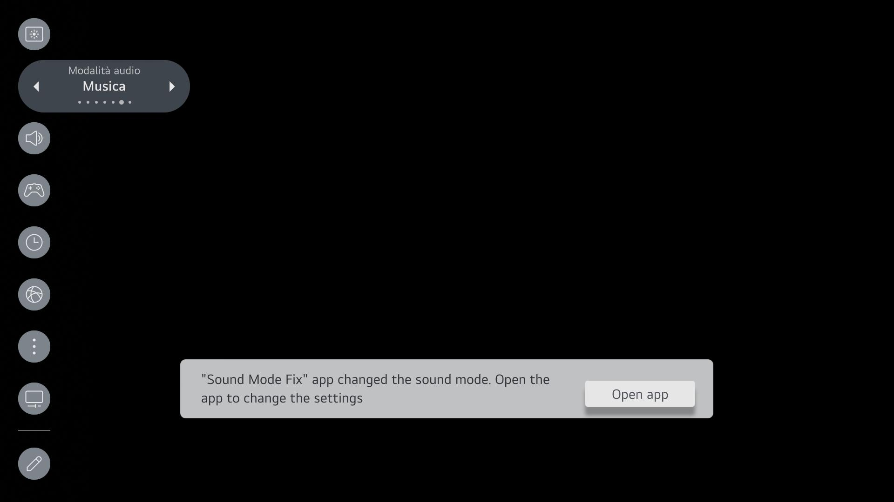

# LG webOS TV Sound Mode Fix app

A simple app that forces the sound mode to be whatever you set it to, even in Game Optimizer mode.

Your TV needs to be [rooted](https://www.webosbrew.org/rooting/) for this app to work.

## Installation

You can install the app from the [Homebrew Channel](https://www.webosbrew.org/develop/) on your modded LG webOS TV.

Or you can download the IPK from the releases page and install it via `ares-install`.

## Acknowledgements

- The scripts in [`tools`](tools) have been adapted
  from [custom-screensaver](https://github.com/webosbrew/custom-screensaver)
- The additional [documentation from webOSbrew](https://www.webosbrew.org/develop/) is invaluable
